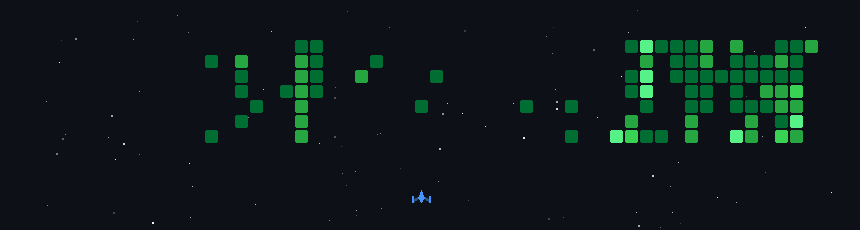

<h1> Hi there! 👋 </h1>

<pre>@@@@@@@@@@@@@@@@@@@@@@@@@@@@@@@@@@@@@@@@@@@@@@@@@@@@@@@@@@@@@@@@@@@@@
@@@@@@@@@@@@@@@@@@@@@@@@@@@@@@@@@@@@@@@@@@@@@@@@@@@@@@@@@@@@@@@@@@@@@
@@██╗@@@@██╗███████╗██╗@@@@@@██████╗@██████╗@███╗@@@███╗███████╗██╗@@
@@██║@@@@██║██╔════╝██║@@@@@██╔════╝██╔═══██╗████╗@████║██╔════╝██║@@
@@██║@█╗@██║█████╗@@██║@@@@@██║@@@@@██║@@@██║██╔████╔██║█████╗@@██║@@
@@██║███╗██║██╔══╝@@██║@@@@@██║@@@@@██║@@@██║██║╚██╔╝██║██╔══╝@@╚═╝@@
@@╚███╔███╔╝███████╗███████╗╚██████╗╚██████╔╝██║@╚═╝@██║███████╗██╗@@
@@@╚══╝╚══╝@╚══════╝╚══════╝@╚═════╝@╚═════╝@╚═╝@@@@@╚═╝╚══════╝╚═╝@@
@@@@@@@@@@@@@@@@@@@@@@@@@@@@@@@@@@@@@@@@@@@@@@@@@@@@@@@@@@@@@@@@@@@@@
@@@@@@@@@@@@@@@@@@@@@@@@@@@@@@@@@@@@@@@@@@@@@@@@@@@@@@@@@@@@@@@@@@@@@</pre>

  
<ins>**CS Student @ UTEC**</ins>

*I'm a **Computer Science student** living in Lima, Peru. Focused on clean code, modern infrastructure, and AI.  
Open to internships and freelance projects!*

<ins>**Some quick info**</ins>

  
  &nbsp;&nbsp;
  

  &nbsp;
  

---

## About me

I always enjoy learning new things and giving my best to every project.

> **Next up:** `Rust` - `Zig` - `NestJS`
>
> **Interests:** `AI` - `Full Stack Development` - `Infrastructure` - `Systems Optimization`

## Tech Stack

&nbsp;&nbsp;&nbsp;&nbsp;&nbsp;&nbsp;&nbsp;&nbsp;&nbsp;&nbsp;&nbsp;&nbsp;&nbsp;&nbsp;&nbsp;&nbsp;&nbsp;&nbsp;&nbsp;&nbsp;

## AI Tools & Workflow

&nbsp;&nbsp;&nbsp;&nbsp;&nbsp;&nbsp;&nbsp;&nbsp;&nbsp;&nbsp;

---

<!-- Animación SVG -->

  

