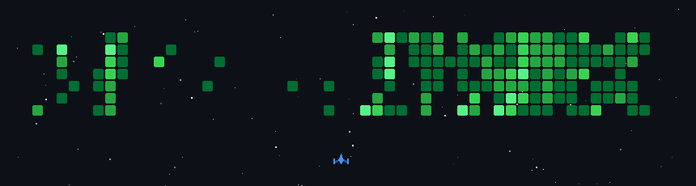

<h1> Hi there 👋, I'm Sebastian! </h1>

<ins>**CS Student @ UTEC**</ins>

*I'm a **Computer Science student** based in Lima, Peru. Passionate about AI & ML Engineering, Full Stack Development, Systems Optimization and Cloud-Native Infrastructure.*

<p align="left">
 <a href="https://sreateguibellido.xyz/" target="_blank"></a>&nbsp;
  <a href="https://www.linkedin.com/in/sebasreateguib" target="_blank"></a>&nbsp;
  <a href="mailto:reateguisebastian1@gmail.com" target="_blank"></a>
</p>

---

## About me

*3rd-year Computer Science Student. I always enjoy learning new things and giving my best to every project.*

```yaml
company: "Open to internships or freelance projects!"
currently_learning: ["LangGraph", "LangChain", "Rust", "NestJS"]
2026_goals: 
  [
    "Just trying to survive third year lol", 
    "Land a role as an AI Engineer or Full Stack Developer",
  ]
```

## Tech Stack
*A collection of tools, languages, and frameworks I have built projects with, learned throughout my university journey, or am actively exploring.*

<p align="left">
&nbsp;&nbsp;&nbsp;&nbsp;&nbsp;&nbsp;&nbsp;&nbsp;&nbsp;&nbsp;&nbsp;&nbsp;&nbsp;&nbsp;&nbsp;&nbsp;&nbsp;&nbsp;&nbsp;&nbsp;&nbsp;&nbsp;&nbsp;&nbsp;&nbsp;&nbsp;&nbsp;&nbsp;&nbsp;&nbsp;&nbsp;&nbsp;&nbsp;&nbsp;&nbsp;&nbsp;&nbsp;&nbsp;&nbsp;&nbsp;&nbsp;&nbsp; 
</p>

<p>
  
  &nbsp;&nbsp;
  <a href="https://git.io/streak-stats">
    
  </a>
</p>

## Space Shooter Game&trade;

*Shooting down bugs before they reach prod lol.*


